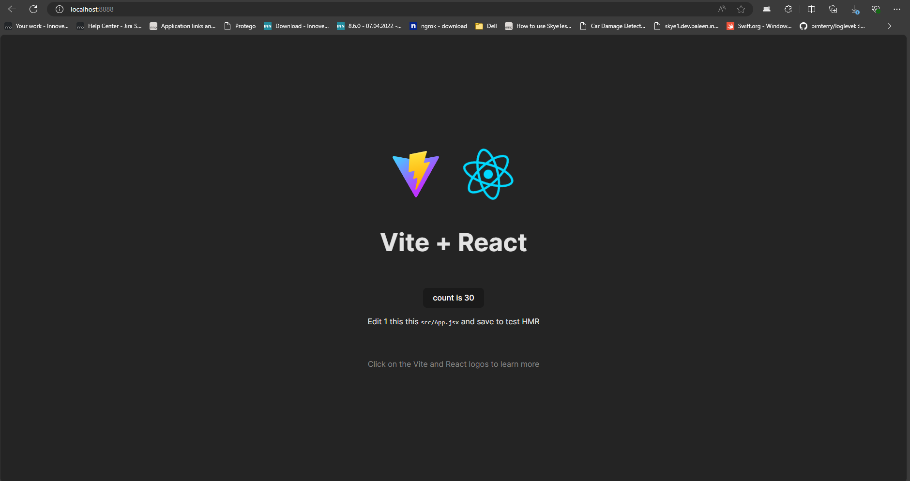
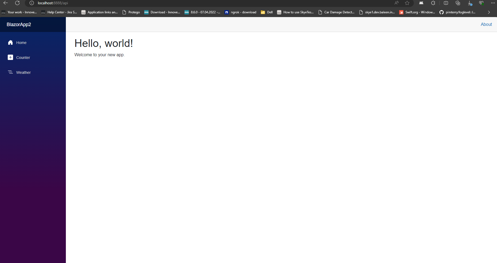
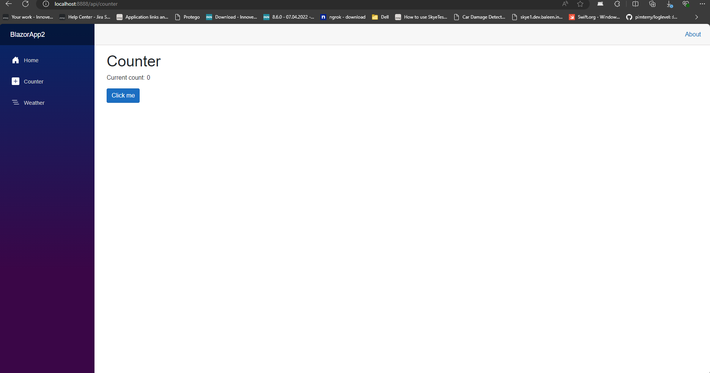

# React + Vite + Blazor + .NET 8

## Screenshots





## Installation

* <b>Install .NET 8</b>
```
https://dotnet.microsoft.com/en-us/download/dotnet/thank-you/runtime-aspnetcore-8.0.6-windows-hosting-bundle-installer
```
* <b>Install Node.JS</b>
```
https://nodejs.org/dist/v20.15.0/node-v20.15.0-x64.msi
```
* <b>Install NodeJS dependencies</b>
```
npm install
```
<b>OR</b>

* use the installation script, install.ps1 (you will need to run as administrator)
```
powershell -ExecutionPolicy ByPass -File .\install.ps1
```

## RUN
To run the app
- It will run React + Vite
- Build BLAZOR with .NET 8
```
npm run dev
```


This template provides a minimal setup to get React working in Vite with HMR and some ESLint rules.

Currently, two official plugins are available:

- [@vitejs/plugin-react](https://github.com/vitejs/vite-plugin-react/blob/main/packages/plugin-react/README.md) uses [Babel](https://babeljs.io/) for Fast Refresh
- [@vitejs/plugin-react-swc](https://github.com/vitejs/vite-plugin-react-swc) uses [SWC](https://swc.rs/) for Fast Refresh
